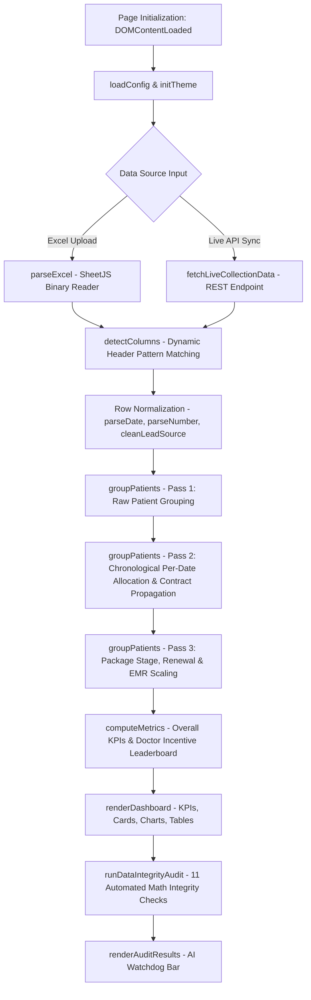
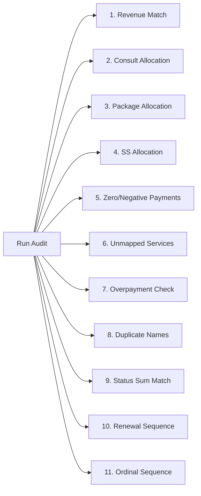

# Technical Context & Complete Logic Blueprint: Daily Collection Report Analyzer (`index.html`)

---

## 📌 1. Executive Architecture & UI System

`index.html` is a high-performance Single-Page Application (SPA) designed for **My Pain Clinic (MPC)** to analyze clinical collection data, compute patient conversion journeys, calculate doctor performance incentives, conduct automated data integrity audits, and export multi-sheet Excel workbooks.

### Tech Stack & Core Dependencies
| Technology / Library | Version | Purpose |
|---|---|---|
| **Inter Typography** | Google Fonts | Primary UI font system |
| **SheetJS (`xlsx.full.min.js`)** | `0.18.5` | Client-side parsing of uploaded `.xlsx` / `.xls` binary files |
| **ExcelJS (`exceljs.min.js`)** | `4.4.0` | Building formatted multi-tab Excel workbooks with custom styles, headers, and totals |
| **Chart.js (`chart.umd.min.js`)** | `4.4.0` | Rendering interactive Doughnut, Bar, Horizontal Bar, and Dual-Axis Line charts |
| **FileSaver.js (`FileSaver.min.js`)** | `2.0.5` | Blob download management for client-side generated files |
| **jsPDF & AutoTable** | `2.5.1` / `3.8.1` | Generating PDF executive summaries |
| **AI Audit Engine (Gemini / Groq)** | REST API | Executive narrative insights and interactive Q&A |

### Theme System (Dark / Light Mode)
Theme state is managed dynamically via the `data-theme` attribute on the `<html>` element (`light` or `dark`). CSS Custom Variables define backgrounds, borders, glassmorphic cards, text colors, and chart color defaults.

---

## 🔄 2. Complete Application Lifecycle & Workflow Architecture



### Lifecycle Execution Steps:
1. **Initialization (`DOMContentLoaded`)**:
   - `loadConfig()`: Loads user-configured keywords from `localStorage` (key: `mpc_report_config`), falling back to default consultation and single session keywords.
   - `initTheme()`: Sets theme based on `localStorage` (key: `mpc_theme`, default `light`).
2. **File Ingestion (`parseExcel`)**:
   - Reads ArrayBuffer from dropped/selected file via `FileReader`.
   - Uses SheetJS to inspect sheet 0.
   - **Header Auto-Discovery**: Scans top 10 rows for the first row containing $\ge 3$ non-empty cells to use as the header row.
3. **Column Detection (`detectColumns`)**:
   - Matches header column labels against regex patterns in `COLUMN_PATTERNS`.
4. **Data Normalization & Classification**:
   - Parses dates (`parseDate`), numbers (`parseNumber`), and lead sources (`cleanLeadSource`).
   - Classifies each row into `consultation`, `single_session`, or `package` via `classifyService`.
5. **Multi-Pass Patient Grouping (`groupPatients`)**:
   - Runs 3 distinct passes to group raw rows, allocate advance payments, track package renewal sequences, and determine patient statuses.
6. **KPI & Leaderboard Computation (`computeMetrics`)**:
   - Computes overall clinical metrics, Doctor Leaderboard, Agent performance, Lead Source efficiency, and time-series trends.
7. **UI Rendering (`renderDashboard`)**:
   - Populates metric cards, status category cards, Doctor Leaderboard, 9-tab patient data tables, 7 Chart.js charts, and analytics summaries.
8. **Automated Audit (`runDataIntegrityAudit`)**:
   - Executes 11 mathematical audit algorithms and renders pass/warning/error badges on the AI Watchdog bar.

---

## 🔍 3. Data Parsing & Normalization Specification

### 3.1 Column Pattern Matcher (`COLUMN_PATTERNS` & `detectColumns`)
The system dynamically maps EMR column headers using regular expressions:

```javascript
const COLUMN_PATTERNS = {
  patientName:      [/patient\s*name/i, /patient/i, /^name$/i],
  patientId:        [/patient\s*id/i, /pat.*id/i, /^id$/i],
  packageName:      [/package\s*name/i, /package/i, /service/i],
  doctor:           [/consult.*doctor/i, /doctor/i, /^dr$/i, /physician/i],
  agent:            [/agent\s*name/i, /agent/i, /counsellor/i, /counselor/i],
  leadSource:       [/lead\s*source/i, /source/i],
  paymentDate:      [/payment\s*date/i, /date/i, /created\s*at/i],
  packageCost:      [/package\s*cost/i],
  amountPaid:       [/amount\s*paid/i, /amount/i, /paid/i, /collection/i],
  totalPackageCost: [/total\s*package\s*cost/i, /total\s*cost/i, /total\s*amount/i],
  paymentMode:      [/payment\s*mode/i, /mode/i, /payment\s*method/i],
  invoiceNo:        [/invoice\s*no/i, /invoice\s*number/i, /bill\s*no/i, /invoice/i],
  userplanId:       [/userplan\s*id/i, /user\s*plan\s*id/i, /plan\s*id/i],
  cartId:           [/cart\s*id/i]
};
```

### 3.2 Date Parsing Engine (`parseDate`)
- Accepts `Date` objects, ISO strings (`YYYY-MM-DDTHH:mm:ss`), Indian date strings (`DD-MM-YYYY`, `DD/MM/YYYY`), and hyphenated/slashed variations.
- Correctly parses 4-digit years vs 2-digit years and extracts hours, minutes, and seconds.

### 3.3 Lead Source Cleaner (`cleanLeadSource`)
- Sanitizes lead source text and extracts platform names from embedded Facebook/Instagram ad JSON payloads (e.g. `{"publisher_platform":"instagram", ...}`).
- Standardizes platforms to: `Instagram`, `Facebook`, `Google`, `YouTube`, `WhatsApp`, `Digital Ad`, or raw headline/campaign strings.

---

## 🏷️ 4. Service Classification & Master Price Registry

### 4.1 Master Services Price Registry (`SERVICES_MASTER_PRICE_LIST`)
Contains 28 official clinical services with keywords, single-session price, and package cost per session:

| Service Name | Key Search Keywords | Single Session Price | Package Price/Session |
|---|---|---|---|
| **Consultation** | `consultation`, `consult` | ₹499 | ₹499 |
| **Women's Health Consultation** | `women's health consultation` | ₹1,500 | ₹1,500 |
| **Foot Insoles** | `foot insole`, `insoles` | ₹2,360 | ₹2,360 |
| **Home Visit** | `home visit` | ₹2,500 | ₹2,500 |
| **Online Consultation** | `online consultation` | ₹2,000 | ₹2,000 |
| **HBOT (Soft Shell)** | `hbot soft`, `soft shell` | ₹2,000 | ₹1,500 |
| **HBOT (Hard Shell)** | `hbot hard`, `hard shell` | ₹2,000 | ₹1,500 |
| **EMS Training** | `ems`, `ems training` | ₹1,800 | ₹1,500 |
| **Focused Shockwave Therapy** | `focused shockwave` | ₹2,000 | ₹1,800 |
| **Ice Bath** | `ice bath` | ₹2,000 | ₹1,500 |
| **Couple Ice Bath** | `couple ice bath` | ₹2,500 | ₹2,500 |
| **Cryotherapy** | `cryotherapy`, `cryo` | ₹2,500 | ₹2,250 |
| **Basic Physiotherapy (BMSK)**| `bmsk`, `basic physio` | ₹1,000 | ₹800 |
| **Advance Physio (AMSK)** | `amsk`, `advance physio` | ₹1,800 | ₹1,500 |
| **Robotic Spine Aligner** | `robotic spine`, `aligner` | ₹2,000 | ₹1,800 |
| **Spine Decompression** | `spine decompression` | ₹1,800 | ₹1,500 |
| **Pilates** | `pilates` | ₹1,000 | ₹800 |
| **Prism** | `prism` | ₹500 | ₹500 |

### 4.2 Classification Logic (`classifyService`)

Every row is evaluated in order through 6 rules:

```javascript
function classifyService(packageName, amountPaid, totalPackageCost) {
  if (!packageName) return 'unknown';
  const lower = packageName.toLowerCase().trim();

  // Rule 0: Foot Insoles product -> single_session
  if (lower.includes('foot insole') || lower.includes('insole')) return 'single_session';

  // Rule 1: Multi-session package pattern (e.g. -3, -4, -6, -12) -> package
  if (/[-_\s]([2-9]|\d{2,})\b/.test(lower) && !lower.includes('ss')) return 'package';

  // Rule 2: Single session explicit tags (-ss, ss-1, single session) -> single_session
  if (lower.includes('-ss') || lower.includes('ss-1') || lower.includes('single session')) return 'single_session';

  // Rule 3: Default Top Up / NA with ₹499 or ₹1500 amount -> consultation; else package
  if (lower === 'default top up' || lower === 'n/a' || lower === '') {
    const amt = Math.round(amountPaid || 0);
    const cost = Math.round(totalPackageCost || 0);
    if (amt === 499 || amt === 1500 || cost === 499 || cost === 1500) return 'consultation';
    return 'package';
  }

  // Rule 4: Consultation Keywords Check
  for (const kw of config.consultationKeywords) {
    if (lower.includes(kw.toLowerCase())) return 'consultation';
  }

  // Rule 5: Single Session Keywords Check
  for (const kw of config.singleSessionKeywords) {
    if (lower.includes(kw.toLowerCase())) return 'single_session';
  }

  // Default fallback
  return 'package';
}
```

---

## 🧮 5. Deep-Dive Multi-Pass Patient Grouping & Allocation Algorithm (`groupPatients`)

The core analytical engine of `index.html` resides in `groupPatients(rows, globalPatients)`. It transforms unstructured, multi-line billing records into clean, audit-verified patient treatment profiles across 3 sequential execution passes:

---

### 5.1 Pass 1: Raw Row Ingestion & Base Profile Initialization

In Pass 1, raw billing records are grouped into patient profile objects keyed by `patientId` (or `patientName`):

```javascript
for (const row of rows) {
  const key = row.patientId || row.patientName;
  if (!key) continue;

  if (!patients[key]) {
    patients[key] = {
      name: row.patientName,
      id: row.patientId,
      _rawRows: [],             // Array of normalized billing rows (cleared in Pass 3)
      services: [],             // Final merged service objects
      hasConsultation: false,   // True if patient had clinical consult (₹499 / ₹1500)
      hasPackage: false,        // True if patient purchased multi-session package
      hasSingleSession: false,  // True if patient purchased single-session service
      status: '',               // Evaluated in Pass 3 (e.g. 'Consultation + Package')
      doctors: new Set(),       // Unique consulting doctors
      agents: new Set(),        // Unique counsellors / agents
      leadSources: new Set(),   // Unique lead channels (Instagram, Facebook, etc.)
      totalPaid: 0,             // Total sum of amountPaid across all dates
      totalPackageValue: 0,     // Total contract value of all package purchases
      consultationRevenue: 0,  // Revenue allocated to consultation
      packageRevenue: 0,       // Revenue allocated to treatment packages
      singleSessionRevenue: 0,  // Revenue allocated to single session services
      packages: []              // Array of package names purchased
    };
  }

  const p = patients[key];
  const serviceType = classifyService(row.packageName, row.amountPaid, row.totalPackageCost);
  const pkgName = (row.packageName || '').trim();

  // Determine standard package cost based on service category & master price list
  let pkgPrice = row.packageCost;
  if (serviceType === 'consultation') {
    pkgPrice = pkgName.toLowerCase().includes('women') ? 1500 : 499;
  } else if (serviceType === 'single_session') {
    pkgPrice = getSingleSessionPrice(pkgName, row.packageCost);
  } else if (serviceType === 'package') {
    pkgPrice = getPackagePrice(pkgName, row.packageCost);
  }

  p._rawRows.push({
    packageName: pkgName,
    type: serviceType,
    doctor: row.doctor,
    agent: row.agent,
    leadSource: row.leadSource,
    paymentDate: row.paymentDate,
    amountPaid: row.amountPaid,
    packageCost: pkgPrice,
    totalPackageCost: row.totalPackageCost,
    paymentMode: row.paymentMode,
    invoiceNo: row.invoiceNo,
    proportionalPaid: 0,
    quantity: 1,
    userplanId: row.userplanId,
    cartId: row.cartId
  });

  p.totalPaid += row.amountPaid;
  if (serviceType === 'consultation') p.hasConsultation = true;
  if (serviceType === 'package') p.hasPackage = true;
  if (serviceType === 'single_session') p.hasSingleSession = true;
  if (row.doctor) p.doctors.add(row.doctor);
  if (row.agent) p.agents.add(row.agent);
  if (row.leadSource) p.leadSources.add(row.leadSource);
}
```

---

### 5.2 Pass 2: Chronological Per-Date Allocation & Contract Metadata Propagation

Pass 2 sorts each patient's `_rawRows` chronologically ascending by `paymentDate` and executes per-date revenue allocation and metadata propagation:

#### **1. Contract Cost & Metadata Propagation**
- **Date Contract Propagation (`totalPackageCost` / Col 7)**: If a patient has multiple package rows on the same payment date and one row has an explicit `totalPackageCost` (Col 7), that contract total is propagated to all package rows for that date.
- **Invoice Number & Payment Mode Propagation**: Propagates `invoiceNo` and `paymentMode` across package rows within the same cart/transaction.

#### **2. Per-Date Revenue Allocation Hierarchy**
For each payment date `dateKey`:

- **Step 1: Consultation Allocation**:
  Deducts exact consultation fee (₹499 or ₹1,500) from `dateTotalPaid`:
  $$\text{Consultation Allocated} = \min(\text{Consultation Fee}, \text{Date Total Paid})$$
  $$\text{Remaining Date Paid} = \text{Date Total Paid} - \text{Consultation Allocated}$$

- **Step 2: Single Session Allocation**:
  Deducts single-session price from `Remaining Date Paid`:
  $$\text{Single Session Allocated} = \min(\text{Single Session Price}, \text{Remaining Date Paid})$$
  $$\text{Remaining Date Paid} = \text{Remaining Date Paid} - \text{Single Session Allocated}$$

- **Step 3: Package Advance Payment Allocation**:
  Allocates `Remaining Date Paid` to treatment packages:
  - **Zero-Paid Bundle Rows Case**: If any package row has `amountPaid == 0`, distribute `Remaining Date Paid` **proportionally** based on sticker `packageCost`:
    $$\text{Proportional Paid}_i = \left( \frac{\text{Package Cost}_i}{\sum \text{Package Cost}} \right) \times \text{Remaining Date Paid}$$
  - **Explicit Amount Paid Case**: Allocate `min(amountPaid, dateRemaining)`.

- **Step 4: Multi-Package Quantity Factor (`dateQtyFactor`)**:
  If invoice package contract total $\ge 1.95 \times$ sticker total, `dateQtyFactor = Math.round(invoicePackageTotal / stickerTotal)`.

#### **3. Category-Based Renewal & Installment Identification Algorithm**

To accurately distinguish between **installment payments** (paying for 1 package across multiple dates) and **true package renewals** (buying a 2nd or 3rd package after completing the 1st), the algorithm tracks category-level financial progress chronologically:

```javascript
const allPkgRows = p._rawRows.filter(r => r.type === 'package');
allPkgRows.sort((a, b) => parseTimestamp(a.paymentDate) - parseTimestamp(b.paymentDate));

if (allPkgRows.length > 0) {
  const firstDateStr = getRowDateStr(allPkgRows[0]);
  const initialPkgCategory = getPackageCategory(allPkgRows[0].packageName);

  const categoryCostSum = {};
  const categoryPaidSum = {};
  const categoryActivePurchase = {};

  allPkgRows.forEach((row) => {
    const cat = getPackageCategory(row.packageName);
    const rowDateStr = getRowDateStr(row);
    const isLaterDate = firstDateStr && rowDateStr > firstDateStr;
    const invOrDate = (row.invoiceNo && row.invoiceNo !== '-') ? row.invoiceNo : rowDateStr;

    if (!(cat in categoryCostSum)) {
      // First package purchase in this category -> 1st Package (Initial)
      categoryCostSum[cat] = row.packageCost > 0 ? row.packageCost : getPackagePrice(row.packageName, 0);
      categoryPaidSum[cat] = 0;
      row.isInstallment = false;
      row.purchaseId = `pkg_${cat.toLowerCase().replace(/[^a-z0-9]/g, '')}_${invOrDate}`;

      // Check if it's a renewal: Patient had consult, date is later, and category matches initial category
      const isSameCategoryAsFirst = (cat === initialPkgCategory);
      if (p.hasConsultation && isLaterDate && isSameCategoryAsFirst) {
        row.isRenewal = true;
      } else {
        row.isRenewal = false;
      }

      categoryActivePurchase[cat] = row;
    } else {
      const prevPaid = categoryPaidSum[cat];
      const prevCost = categoryCostSum[cat];

      if (prevPaid < prevCost - 0.01) {
        // Unpaid balance remains on prior package -> Tagged as Installment Payment (NOT a Renewal)
        row.isInstallment = true;
        row.purchaseId = categoryActivePurchase[cat] ? categoryActivePurchase[cat].purchaseId : `pkg_${cat.toLowerCase().replace(/[^a-z0-9]/g, '')}_${invOrDate}`;
        row.isRenewal = categoryActivePurchase[cat] ? categoryActivePurchase[cat].isRenewal : false;
      } else {
        // Prior package fully paid -> Tagged as New Package Purchase
        row.isInstallment = false;
        row.purchaseId = `pkg_${cat.toLowerCase().replace(/[^a-z0-9]/g, '')}_${invOrDate}`;

        const isSameCategoryAsFirst = (cat === initialPkgCategory);
        if (p.hasConsultation && isLaterDate && isSameCategoryAsFirst) {
          row.isRenewal = true;  // Tagged as Renewal Package!
        } else {
          row.isRenewal = false;
        }

        categoryActivePurchase[cat] = row;
        categoryCostSum[cat] += row.packageCost > 0 ? row.packageCost : getPackagePrice(row.packageName, 0);
      }
    }

    categoryPaidSum[cat] += (row.proportionalPaid || 0);
  });
}
```

---

### 5.3 Pass 3: Aggregation, EMR Bundle Scaling, & Renewal Ordinal Stage Labelling

#### **1. Service Merging (`pkgMap`)**
Pass 3 aggregates `_rawRows` by `svcKey` (`packageName_type_isRenewal_purchaseId`) to sum `amountPaid` and `proportionalPaid` while keeping initial package purchases distinct from renewal purchases.

#### **2. EMR Bundle Total Scaling (`bundleScaleFactor`)**
If EMR bundle contract total (`bundleTotalFromExcel` / Col 7) is less than the sum of individual sticker costs (`stickerTotal`):
$$\text{bundleScaleFactor} = \frac{\text{bundleTotalFromExcel}}{\text{stickerTotal}}$$
$$\text{Effective Package Value} = \text{Sticker Package Cost} \times \text{bundleScaleFactor}$$

#### **3. Package Renewal Ordinal Sequence Stage Labelling**
Every package purchase is assigned an ordinal stage label based on its chronological purchase sequence within its treatment category:

```javascript
function getPackageStageLabel(svc, allServices) {
  if (svc.type !== 'package') return svc.type;
  if (!svc.isRenewal) return '1st Package (Initial)';

  const cat = getPackageCategory(svc.packageName);
  const sameCatRenewals = allServices
    .filter(s => s.type === 'package' && s.isRenewal && getPackageCategory(s.packageName) === cat)
    .sort((a, b) => (a.paymentDate ? new Date(a.paymentDate).getTime() : 0) - (b.paymentDate ? new Date(b.paymentDate).getTime() : 0));

  const renewalIndex = sameCatRenewals.findIndex(s => s.purchaseId === svc.purchaseId || s.packageName === svc.packageName);
  if (renewalIndex === 0) return '2nd Package (Renewal 1)';
  if (renewalIndex === 1) return '3rd Package (Renewal 2)';
  return `${renewalIndex + 2}th Package (Renewal ${renewalIndex + 1})`;
}
```

#### **4. Patient Status Determination Matrix (`determineStatus`)**

| Consultation? | Package? | Single Session? | Final Status Label |
|:---:|:---:|:---:|---|
| Yes | Yes | Yes | `Consultation + Package + Single Session` |
| Yes | Yes | No | `Consultation + Package` |
| Yes | No | Yes | `Consultation + Single Session` |
| Yes | No | No | `Only Consultation` |
| No | Yes | Yes | `Package + Single Session` |
| No | Yes | No | `Only Package` |
| No | No | Yes | `Only Single Session` |

---

## 🏆 6. Metrics & Doctor Incentive Leaderboard Logic (`computeMetrics`)

### 6.1 Revenue & Patient Metrics
- **Total Patients**: Total unique patient count.
- **Consultation Patients**: Patients with `hasConsultation == true`.
- **Conversion Rate %**:
  $$\text{Conversion Rate \%} = \frac{\text{Converted Patients (Consult + Pkg)}}{\text{Total Consultation Patients}} \times 100$$
- **Revenue Categories**: `totalRevenue`, `consultationRevenue`, `packageRevenue`, `ssRevenue`, `renewalTotalRevenue`.

### 6.2 Doctor Incentive Ranking & Pain Management Conversion Algorithm
To prevent double-counting renewals, **ONLY initial package conversions (1st package after consult)** count toward Doctor Incentive rankings:

- **Doctor Consultations**: Patients who consulted with Doctor X (`p.hasConsultation == true`).
- **Doctor Converted Patients**: Consulted patients who purchased an **Initial Treatment Package** (`!isRenewal`).
- **Pain Management Converted Patients**: Converted patients whose initial package was a **Pain Management Package** (e.g. PM-12, PM-6).
- **Doctor Pain Management Conversion Rate %**:
  $$\text{Doctor PM Conv \%} = \min\left(100, \frac{\text{Pain Mgmt Converted Patients}}{\text{Doctor Consultations}} \times 100\right)$$

#### Doctor Ranking & Badge System:
Doctors are sorted by `painMgmtCount` descending, then `painMgmtRevenue` descending:
- **Rank 1**: `🥇 1st` $\rightarrow$ Badge: `⭐ Top Converter` (`badge-emerald`)
- **Rank 2 & 3**: `🥈 2nd`, `🥉 3rd` $\rightarrow$ Badge: `🔥 High Performer` (`badge-purple`)
- **Rank 4+**: `#N` $\rightarrow$ Badge: `👍 Contributor` (`badge-cyan`)

---

## 🛡️ 7. AI Watchdog Data Integrity Audit Engine (`runDataIntegrityAudit`)

The watchdog executes 11 mathematical audit algorithms to ensure 100% data integrity:



### Audit Specifications:
1. **Total Revenue Verification**:
   Validates if $| \text{totalPaid} - (\text{consultationRev} + \text{packageRev} + \text{ssRev}) | < 0.01$.
2. **Consultation Revenue Audit**:
   Ensures consultation revenue matches expected fee sum.
3. **Package Revenue Audit**:
   Verifies treatment package proportional allocations.
4. **Single Session Revenue Audit**:
   Verifies standalone session allocations.
5. **Zero / Negative Payment Check**:
   Identifies collection rows where `amountPaid <= 0`.
6. **Unmapped Service Classification Check**:
   Flags packages returning `classifyService == 'unknown'`.
7. **Package Value Overpayment Check**:
   Flags records where `proportionalPaid > packageCost * 1.5`.
8. **Duplicate Patient Name Detection**:
   Identifies potential duplicate patient records via normalized names (`trim().toLowerCase()`).
9. **Status Count Sum Verification**:
   Verifies $\sum \text{statusCounts} == \text{totalPatients}$.
10. **Renewal Sequence Audit**:
    Flags patients with `isRenewal == true` but no initial package record.
11. **Package Renewal Ordinal Sequence Audit**:
    Validates package ordinal sequences (e.g. 1st $\to$ 2nd $\to$ 3rd) to ensure installment splitting did not cause ordinal jumps.

---

## ⚡ 8. Live Database Connection & Duplication Blueprint

To replace manual Excel uploading with a live API feed (Google Apps Script Web App, Supabase, Vercel Serverless API, or PostgreSQL Endpoint), add this function:

```javascript
const LIVE_COLLECTION_API_URL = 'YOUR_LIVE_DATABASE_API_URL_HERE';

async function fetchLiveCollectionData() {
  const loadingOverlay = document.getElementById('loading-overlay');
  const loadingText = document.getElementById('loading-text');
  if (loadingOverlay) loadingOverlay.classList.add('show');
  if (loadingText) loadingText.textContent = 'Syncing Live Collection Database...';

  try {
    const response = await fetch(LIVE_COLLECTION_API_URL, { cache: 'no-store' });
    const json = await response.json();
    const rows = Array.isArray(json) ? json : (json.data || []);

    if (rows.length === 0) {
      throw new Error('No records returned from live database API');
    }

    const sampleKeys = Object.keys(rows[0]);
    columnMap = detectColumns(sampleKeys);

    rawRows = rows.map(r => ({
      patientName:      String(r.patientName || r['Patient Name'] || r.patient_name || '').trim(),
      patientId:        String(r.patientId || r['Patient ID'] || r.patient_id || '').trim(),
      packageName:      String(r.packageName || r['Package Name'] || r.package_name || r.service || '').trim(),
      doctor:           String(r.doctor || r['Consulting Doctor'] || r.doctor_name || '').trim(),
      agent:            String(r.agent || r['Agent Name'] || r.agent_name || '').trim(),
      leadSource:       cleanLeadSource(r.leadSource || r['Lead Source'] || r.source),
      paymentDate:      parseDate(r.paymentDate || r['Payment Date'] || r.created_at || r.date),
      packageCost:      parseNumber(r.packageCost || r['Package Cost']),
      amountPaid:       parseNumber(r.amountPaid || r['Amount Paid'] || r.amount),
      totalPackageCost: parseNumber(r.totalPackageCost || r['Total Package Cost']),
      paymentMode:      String(r.paymentMode || r['Payment Mode'] || '').trim(),
      invoiceNo:        String(r.invoiceNo || r['Invoice No'] || '').trim(),
      userplanId:       String(r.userplanId || r['Userplan ID'] || '').trim(),
      cartId:           String(r.cartId || r['Cart ID'] || '').trim()
    })).filter(r => r.patientName !== '');

    allPatients = groupPatients(rawRows);
    filteredPatients = allPatients;
    currentMetrics = computeMetrics(filteredPatients);

    populateFilters();
    renderDashboard(currentMetrics, filteredPatients);

    const auditResults = runDataIntegrityAudit(currentMetrics, filteredPatients);
    renderAuditResults(auditResults);

    document.getElementById('upload-section').classList.add('hidden');
    document.getElementById('dashboard-section').classList.remove('hidden');
    document.getElementById('dash-file-name').textContent = 'Live Database Sync';
    document.getElementById('dash-row-count').textContent = `${rawRows.length} collection records`;

    showToast(`Live database connected: ${rawRows.length} records loaded`, 'success');

  } catch (err) {
    console.error('Error fetching live collection data:', err);
    showToast('Failed to load live database: ' + err.message, 'error');
  } finally {
    if (loadingOverlay) loadingOverlay.classList.remove('show');
  }
}
```

---
