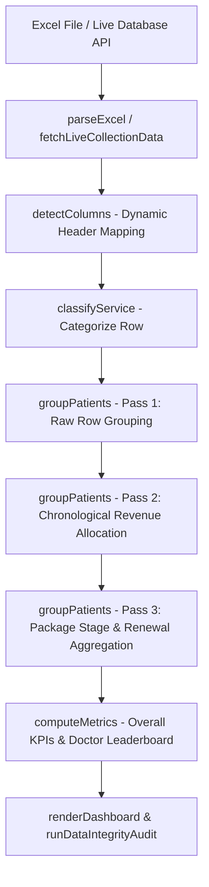

# Technical Context & Architecture Specification: Daily Collection Report Analyzer (`index.html`)

---

## 📌 Executive Architecture Overview

`index.html` is a high-performance, single-page web application (SPA) built for **My Pain Clinic (MPC)** to analyze daily clinical collection reports, track patient treatment conversion journeys, calculate doctor performance incentives, audit data integrity, and export multi-tab Excel workbooks.

### Key Capabilities:
1. **Dynamic File & Database Ingestion**: Reads Excel files (`.xlsx`, `.xls`) or live API endpoints via SheetJS / fetch, detecting column variations automatically.
2. **Multi-Pass Patient Grouping & Revenue Allocation**: Grouping raw invoice transaction rows into unified patient profiles with proportional advance payment distribution across consultation, single-session services, and multi-session treatment packages.
3. **Automated Service Classification**: Classifies services into `consultation`, `single_session`, and `package` using configured rules and a master service price registry.
4. **Doctor Incentive & Conversion Leaderboard**: Ranks consulting doctors based on initial Pain Management package conversions, conversion rates, and revenue.
5. **AI Watchdog Data Integrity Audit**: Runs 11 automated mathematical audit checks to detect revenue discrepancies, ordinal sequence jumps, duplicate names, or unallocated funds.
6. **Multi-Tab Excel & PDF Export**: Generates 15 categorized Excel sheets using `ExcelJS` with professional styling, totals, and column widths.

---

## 🛠️ Technology Stack & Libraries

| Library / Tool | Version | Purpose |
|---|---|---|
| **Inter Font** | Google Fonts | Modern, clean UI typography |
| **SheetJS (xlsx)** | `0.18.5` | Parsing uploaded Excel workbooks into raw JSON arrays |
| **ExcelJS** | `4.4.0` | Building formatted, multi-sheet downloadable `.xlsx` files |
| **Chart.js** | `4.4.0` | Rendering interactive charts (Doughnut, Bar, Dual-Axis Line) |
| **FileSaver.js** | `2.0.5` | Saving client-side generated files |
| **jsPDF & AutoTable** | `2.5.1` / `3.8.1` | Generating PDF executive summaries |
| **AI Engine (Gemini / Groq)** | REST API | Generating executive reports and answering natural language queries |

---

## 📊 Core Data Flow Pipeline



---

## 🔍 Detailed Data Processing & Algorithm Specifications

### 1. Column Detection Engine (`detectColumns`)
The system accepts non-standardized header names across different EMR exports using Regular Expressions:
* `patientName`: `/patient\s*name/i`, `/patient/i`, `/^name$/i`
* `patientId`: `/patient\s*id/i`, `/pat.*id/i`, `/^id$/i`
* `packageName`: `/package\s*name/i`, `/package/i`, `/service/i`
* `doctor`: `/consult.*doctor/i`, `/doctor/i`, `/^dr$/i`, `/physician/i`
* `agent`: `/agent\s*name/i`, `/agent/i`, `/counsellor/i`
* `leadSource`: `/lead\s*source/i`, `/source/i`
* `paymentDate`: `/payment\s*date/i`, `/date/i`, `/created\s*at/i`
* `packageCost`: `/package\s*cost/i`
* `amountPaid`: `/amount\s*paid/i`, `/amount/i`, `/paid/i`, `/collection/i`
* `totalPackageCost`: `/total\s*package\s*cost/i`, `/total\s*cost/i`
* `paymentMode`: `/payment\s*mode/i`, `/mode/i`
* `invoiceNo`: `/invoice\s*no/i`, `/invoice/i`, `/bill\s*no/i`

---

### 2. Service Classification Engine (`classifyService`)
Every line item is evaluated against 5 hierarchical classification rules:

```javascript
// Rule 0: Foot Insoles product -> single_session
if (lower.includes('foot insole') || lower.includes('insole')) return 'single_session';

// Rule 1: Multi-session package pattern (e.g., -3, -4, -6, -12) -> package
if (/[-_\s]([2-9]|\d{2,})\b/.test(lower) && !lower.includes('ss')) return 'package';

// Rule 2: Single session explicit tags (-ss, ss-1, single session) -> single_session
if (lower.includes('-ss') || lower.includes('ss-1') || lower.includes('single session')) return 'single_session';

// Rule 3: Default Top Up / NA with ₹499/₹1500 fee -> consultation; else package
if (lower === 'default top up' || lower === 'n/a' || lower === '') {
  return (amt === 499 || amt === 1500) ? 'consultation' : 'package';
}

// Rule 4 & 5: Configured Consultation & Single Session Keywords
```

---

### 3. Patient Grouping & Proportional Revenue Allocation (`groupPatients`)

#### **Pass 1: Raw Row Grouping**
Groups invoice transactions by `patientId` (or `patientName`).

#### **Pass 2: Chronological Per-Date Allocation**
For each payment date:
1. **Consultation Allocation**: Deducts exact fixed fee (e.g. ₹499 or ₹1,500) from `dateTotalPaid`.
2. **Single Session Allocation**: Deducts master list single session price (e.g. ₹1,800, ₹2,360) from remaining funds.
3. **Package Allocation**: Distributes remaining advance payment proportionally across active treatment packages based on their sticker costs (`packageCost`):
   $$\text{Proportional Paid} = \left( \frac{\text{Package Cost}}{\sum \text{Package Costs}} \right) \times \text{Remaining Advance Paid}$$

#### **Pass 3: Renewal & Package Ordinal Tracking**
* Evaluates chronological payment sequence per package category (Pain Management, Wellness, Robotic Spine, BMSK).
* **Initial Package**: The 1st treatment package purchased after consultation.
* **Package Renewal**: Any subsequent package purchased in the same category on a later date.

---

### 4. Patient Status Categories

| Status Label | Criteria |
|---|---|
| **Only Consultation** | Has consultation, no packages, no single sessions |
| **Consultation + Package** | Has consultation and treatment package(s) |
| **Consultation + Single Session** | Has consultation and single session(s) |
| **Consultation + Package + Single Session** | Has consultation, package(s), and single session(s) |
| **Only Package** | Direct package purchase without clinical consultation |
| **Only Single Session** | Direct single session purchase without consultation |
| **Package + Single Session** | Package and single session without consultation |
| **Package Renewal** | Patient who renewed a treatment package |

---

### 5. Doctor Incentive & Conversion Metrics (`doctorMap`)
Only **Initial Package Conversions** (1st package after consultation) are credited to doctors for incentive rankings to prevent double-counting renewals:
* **Consultations Counted**: Patients who had a consultation with the doctor.
* **Pain Management Conversions**: Converted patients who bought a Pain Management package (e.g. PM-12, PM-6).
* **Pain Mgmt Conversion Rate %**:
  $$\text{PM Conv \%} = \min\left(100, \frac{\text{PM Converted Patients}}{\text{Total Consultations}} \times 100\right)$$

---

### 6. AI Watchdog Data Integrity Audit Engine (`runDataIntegrityAudit`)
Runs 11 automated verification checks:
1. **Total Revenue Verification**: Validates sum of `totalPaid` against sum of categorized revenues (`consultation` + `package` + `single_session`).
2. **Consultation Revenue Audit**: Checks for unallocated consultation payments.
3. **Package Revenue Audit**: Verifies treatment package allocations.
4. **Single Session Revenue Audit**: Verifies standalone session allocations.
5. **Negative / Zero Payment Anomalies**: Identifies records with ₹0 collection.
6. **Unknown Service Categories**: Flags unmapped package names.
7. **Package Value Overpayment Check**: Detects overpayment anomalies.
8. **Duplicate Patient Detection**: Identifies potential duplicate patient records.
9. **Status Sum Verification**: Verifies status count sum equals total patient count.
10. **Renewal Sequence Audit**: Ensures renewals have prior initial package records.
11. **Ordinal Jump Audit**: Detects installment-induced ordinal jumps (e.g. 1st -> 3rd).

---

## ⚡ How to Connect / Duplicate `index.html` with a Live Database API

To replace manual Excel uploading with a live database feed (Google Apps Script Web App, Supabase, Vercel Serverless API, or PostgreSQL REST Endpoint), follow these steps:

### 1. Live API Data Fetch Function (`fetchLiveCollectionData`)

Add this live fetch function into the JavaScript block of `index.html`:

```javascript
const LIVE_COLLECTION_API_URL = 'YOUR_LIVE_DATABASE_API_URL_HERE';

async function fetchLiveCollectionData() {
  const loadingOverlay = document.getElementById('loading-overlay');
  const loadingText = document.getElementById('loading-text');
  if (loadingOverlay) loadingOverlay.classList.add('show');
  if (loadingText) loadingText.textContent = 'Syncing Live Collection Database...';

  try {
    const response = await fetch(LIVE_COLLECTION_API_URL, { cache: 'no-store' });
    const json = await response.json();
    const rows = Array.isArray(json) ? json : (json.data || []);

    if (rows.length === 0) {
      throw new Error('No records returned from live database API');
    }

    // Auto-detect columns from live JSON keys
    const sampleKeys = Object.keys(rows[0]);
    columnMap = detectColumns(sampleKeys);

    rawRows = rows.map(r => ({
      patientName:      String(r.patientName || r['Patient Name'] || r.patient_name || '').trim(),
      patientId:        String(r.patientId || r['Patient ID'] || r.patient_id || '').trim(),
      packageName:      String(r.packageName || r['Package Name'] || r.package_name || r.service || '').trim(),
      doctor:           String(r.doctor || r['Consulting Doctor'] || r.doctor_name || '').trim(),
      agent:            String(r.agent || r['Agent Name'] || r.agent_name || '').trim(),
      leadSource:       cleanLeadSource(r.leadSource || r['Lead Source'] || r.source),
      paymentDate:      parseDate(r.paymentDate || r['Payment Date'] || r.created_at || r.date),
      packageCost:      parseNumber(r.packageCost || r['Package Cost']),
      amountPaid:       parseNumber(r.amountPaid || r['Amount Paid'] || r.amount),
      totalPackageCost: parseNumber(r.totalPackageCost || r['Total Package Cost']),
      paymentMode:      String(r.paymentMode || r['Payment Mode'] || '').trim(),
      invoiceNo:        String(r.invoiceNo || r['Invoice No'] || '').trim(),
      userplanId:       String(r.userplanId || r['Userplan ID'] || '').trim(),
      cartId:           String(r.cartId || r['Cart ID'] || '').trim()
    })).filter(r => r.patientName !== '');

    // Process & Render Live Dashboard
    allPatients = groupPatients(rawRows);
    filteredPatients = allPatients;
    currentMetrics = computeMetrics(filteredPatients);

    populateFilters();
    renderDashboard(currentMetrics, filteredPatients);

    // Run AI Watchdog Audit
    const auditResults = runDataIntegrityAudit(currentMetrics, filteredPatients);
    renderAuditResults(auditResults);

    // Show Dashboard UI
    document.getElementById('upload-section').classList.add('hidden');
    document.getElementById('dashboard-section').classList.remove('hidden');
    document.getElementById('dash-file-name').textContent = 'Live Database Sync';
    document.getElementById('dash-row-count').textContent = `${rawRows.length} collection records`;

    showToast(`Live database connected: ${rawRows.length} records loaded`, 'success');

  } catch (err) {
    console.error('Error fetching live collection data:', err);
    showToast('Failed to load live database: ' + err.message, 'error');
  } finally {
    if (loadingOverlay) loadingOverlay.classList.remove('show');
  }
}
```

### 2. Auto-Sync on Page Load (`DOMContentLoaded`)

Replace the file upload listener in `document.addEventListener('DOMContentLoaded')` with auto-sync:

```javascript
document.addEventListener('DOMContentLoaded', () => {
  config = loadConfig();
  initTheme();
  
  // Auto-connect to Live Database on startup
  fetchLiveCollectionData();
});
```

---

## 🎯 Summary of Key Files in Repository

* **`index.html`**: Daily Collection Report Analyzer & Conversion Intelligence Dashboard.
* **`calling_analyzer.html`**: Master Calling Operations & Lead Dialing Intelligence Dashboard.
* **`appointment_analyzer.html`**: Patient Appointment Schedule & Attendance Analyzer.
* **`api/leads.js`**: Vercel Serverless Proxy endpoint for CORS-free Google Apps Script database fetching.
* **`context.md`**: Complete technical documentation & architecture specification.
